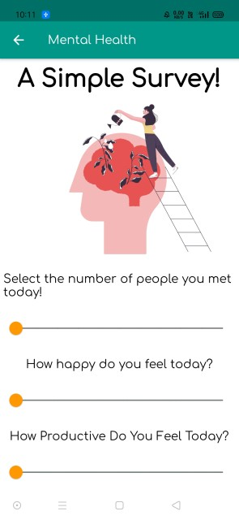
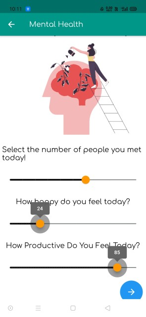
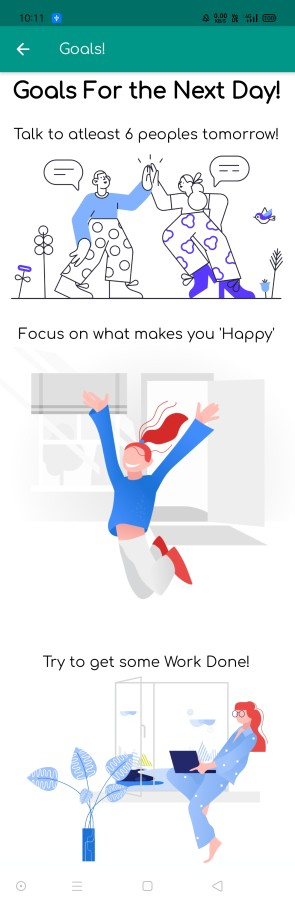
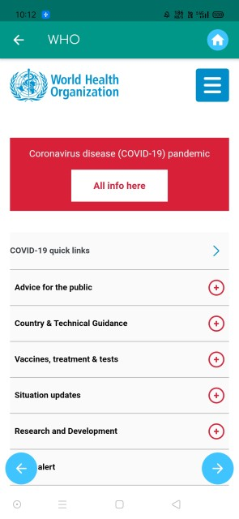

# MAD-project
## Project repo for [APK Fest's MAD event](https://www.notion.so/Problem-Statements-for-MAD-21-95d5b154c6a94747913168504904361c)

### Team - __Binary Bombers__

## Team Members
- [Mitul Varshney](https://github.com/Mitul16)
- [Aditya Verma](https://github.com/homewardgamer)
- [Parv Choudhary](https://github.com/Parvchoudhary)

### We have chosen __Theme 1__ - 🥼 Health Care and Fitness
The basic problem we are trying to solve with the help of our simple to use app is to improve human health, both *physically* and *mentally*

## Screenshots

